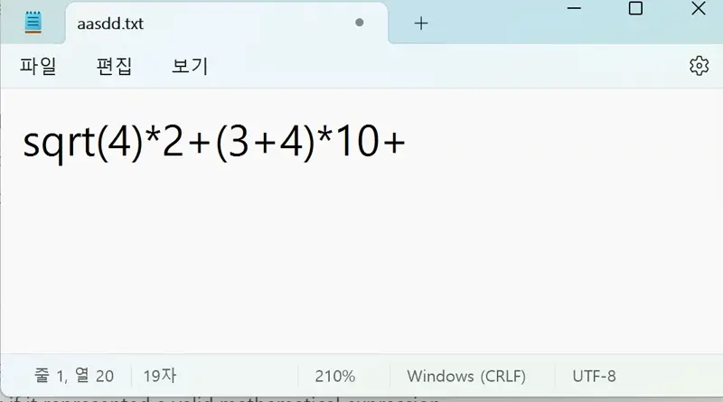

# NotepadCalc
Making Notepad to be Calculator! (using WIN32 API Hooking)

# Motivation 
One of my hobbies is reverse engineering, where I dive deep into the inner workings of software to understand, modify, or enhance its functionality. Recently, I found myself getting frustrated with the basic calculator that comes pre-installed on most operating systems. While it’s great for quick calculations, it becomes cumbersome when trying to input slightly more complex expressions or when the window size doesn’t provide enough space to view the full equation.

I began to wonder: what if there was a way to combine the simplicity of a text editor with the functionality of a calculator? That way, I could freely type out calculations in a larger, more flexible space while retaining the ability to perform real-time calculations.

That’s when the idea struck me. I decided to use one of the simplest and most universally available programs—Notepad—and turn it into a functional calculator using my reverse engineering skills. By leveraging API Hooking techniques, I could intercept and modify the behavior of Notepad to allow it to calculate expressions directly within the text editor. This would let me type out equations in a familiar, spacious environment, with instant feedback on the results.

# The Result
The result is a tool that combines the best of both worlds: the flexibility and simplicity of Notepad, with the added functionality of a basic calculator. I can now type out equations in full, see the entire context of what I’m calculating, and get instant results simply by saving the file, without having to switch between programs or strain my eyes trying to fit everything into a tiny calculator window.

This project not only solved a practical problem but also provided a perfect opportunity to apply my reverse engineering skills in a fun and useful way. By using API Hooking, specifically during the file-saving process, I was able to extend the functionality of a simple program like Notepad, demonstrating how powerful and versatile reverse engineering can be when applied creatively.
